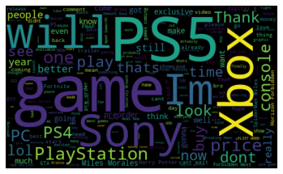
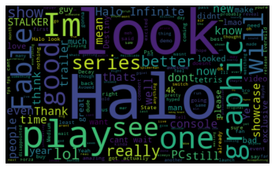

Motivations
-------

One of my objectives was to work on my first NLP project and deal with unstructured data. Now it's done! And believe me, it was my most challenging project... I analysed YouTube comments from the PS5 showcase and the Xbox Series X showcase. My goal was to measure the overall excitment towards the two game consoles and their respective games.

Sources
-------

PS5 showcase: *https://www.youtube.com/watch?v=tjji8NEW9lo*

Xbox Series X showcase: *https://www.youtube.com/watch?v=fjS3EHKWPxY*

This website helped me to understand the process of tokenization, POS tagging and lemmatization: *https://www.machinelearningplus.com/nlp/lemmatization-examples-python/*

These two articles helped me to learn to use the VADER and TextBlob libraries for sentiment detection: *https://towardsdatascience.com/sentiment-analysis-vader-or-textblob-ff25514ac540*

*https://medium.com/analytics-vidhya/textblob-the-nlp-preprocessing-godsend-1b404c35732e*

The code
-------

Click [here](https://github.com/SalimAmarti/PS5_vs_XboxSeriesX/blob/master/PS5%20vs.%20Xbox%20Series%20X.ipynb) to view the code.

Executive Summary
-------

- Overall sentiment for the PS5 showcase:
  - Positive: 36%
  - Neutral: 48%
  - Negative: 16%
  
- Overall sentiment for the Xbox Series X showcase:
  - Positive: 40%
  - Neutral: 41%
  - Negative: 18%
  
- Most discussed PS5 games:
  - N°1) Spider-Man: Miles Morales
  - N°2) Hogwarts Legacy
  - N°3) Final Fantasy XVI
  
- Most discussed Xbox Series X games:
  - N°1) Halo Infinite
  - N°2) Fable 4
  - N°3) S.T.A.L.K.E.R. 2

- Wordclouds:

   

Approach
-------

To be honest, this project was very hard for me. I now realise how difficult it is to work with unstructured data! But it was also so enriching and rewarding to work on this. At first, I wanted to analyse tweets that were posted in September because this was an eventful month (showcase, price announcements...). I investigated the Twitter API but the limitations were too restrictive for my project (only have access to the last 7 days of data). Then I investigated the Twitter scrapers (Twint, tweetscraper, GetOldTweets3, etc.) but for some reasons none of them were working. So I decided to change the scope, work on YouTube data and analyse the game showcases.

Then, I wanted to scrape the YouTube data myself using Selenium. But it did not work: I only managed to collect 350-400 comments. I will investigate more into web scrapers in one of my next projects. I used Coberry to get the data.

My main objective for this project was to perform sentiment analysis on the data. I came across two Python libraries called VADER and TextBlob to map words to polarity scores. 'Good' would have 1.0 in 'positivity', 0.0 in 'neutral' and 0.0 in 'negative' while 'bad' would have 0.0 in 'positivity', 0.0 in 'neutral' and 1.0 in 'negative'.
I also cleaned the data using NLP techniques such as tokenization, part-of-speech tagging and lemmatization. I then developped an approach to assess which technique would be the best one with this dataset. I took a random sample of a 100 comments and manually tagged them positive, neutral or negative. Then, I confronted this sample to VADER, TextBlob combined with the raw data or the cleaned data. Based on how well each technique was doing, I was able to choose one specific approach.
The VADER sentiment tagging performed on the raw data managed to get a 57% accuracy which was the best one I could get. One could say that this represents a low accuracy but I was quite happy with the result. Indeed, the dataset is based on YouTube comments of people talking mostly in a familiar way which is quite hard for an algorithm to detect the true sentiment.

With the cleaned and processed data, I was also able to determine which games were the most discussed and what was the overall sentiment for each game. I could also create wordclouds and discover which keywords were the most used for each showcase.

Next steps / Improvements
-------

- I believe that the main improvement would be to create a Machine Learning algorithm to detect the sentiment. But this would require more text data and a lot of time to train the algorithm (manual input would be needed for the algorithm to recognize sarcasm for example). This is surely something that I would want to investigate for another project.

Infographics
-------

